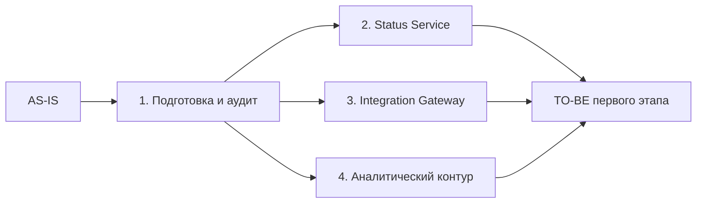

# Roadmap миграции

> Назначение документа: показать безопасный путь от AS-IS к TO-BE через промежуточные состояния, зависимости, риски, условия остановки и критерии завершения этапов.

## 0. Паспорт roadmap

| Поле | Значение |
|---|---|
| Название проекта | Трансформация платформы RetailCore |
| Связанный документ трансформации | [transformation.md](../Task3/transformation.md) |
| Горизонт планирования | 12 месяцев (первая очередь трансформации) |
| Выбранная стратегия миграции | Incremental Migration (Strangler Fig + Parallel Run) |
| Ключевые паттерны | Strangler Fig, Event-Driven, Database Decomposition, ACL для внешних интеграций |
| Автор | Архитектор |
| Дата | 2026-06-30 |
| Версия | 1.0 |

## 1. Краткое резюме roadmap

Миграция выполняется инкрементально в связи с требованием бизнеса к недопустимости остановки. При этом полный объем скрытых зависимостей монолита и Oracle неизвестен.
Сначала команда выделяет статусную модель как первый безопасный сервис, после этого унифицирует интеграционный слой и отделяет аналитику от операционной БД, и только затем приступает к выделению ценообразования.
Основные риски roadmap связаны со скрытыми Oracle-зависимостями, возможной деградацией checkout при любых изменениях кор функционала, поэтому для каждого этапа заданы критерии готовности и условия остановки.

## 2. Стартовое и целевое состояние

| Состояние | Описание | Ключевые ограничения | Метрики / признаки состояния |
|---|---|---|---|
| AS-IS | Монолитное ядро на Java управляет всем жизненным циклом заказа; Oracle — единая СУБД для операций, бизнес-логики и интеграций; интеграции разнородны; поддержка зависит от ручных операций | Нельзя останавливать checkout; Oracle-зависимости не задокументированы; ресурсы on-premise на пределе | p95 latency checkout — требует уточнения; доля ручных эскалаций — треубет уточнения |
| Промежуточное 1: Status Service | Статусы заказа — единый источник правды; клиентские и технические статусы разделены; фиксируется история с причинами изменений | Монолит продолжает писать в Oracle для совместимости; интеграции и аналитика по-прежнему через БД | 100% изменений статуса через Status Service; расхождение Oracle и Status Service менее 1%; время обработки обращений по статусам снижено на 30% |
| Промежуточное 2: Integration Gateway | Единый шлюз для всех исходящих интеграций; отказ от staging-таблиц Oracle; внедрение идемпотентности и гарантированной доставки | Прямые синхронные вызовы платежного шлюза сохранены; .NET-сервис интегрирован с gateway | 100% исходящих интеграций через единый гейтвей; staging-таблицы не используются |
| Промежуточное 3: выделен аналитический контур | Аналитика отделена от основного хранилища; определена каноническая модель заказа; подготовлена потоковая загрузка из Event Stream | постепенная миграция исторических данных; постепенная миграция batch-отчетов из старого контура | более 90% аналитических запросов через новое хранилище; нагрузка на основное хранилище от аналитики снижена более чем на 70% |
| TO-BE первого этапа | Монолит сохранен для checkout и платежной оркестрации; Status Service, Pricing Service, Integration Gateway, Event Stream и аналитическое хранилище — введены в эксплуатацию; Oracle — только для операционных данных заказа | Полная замена монолита и полная миграция с Oracle **не являются частью данного этапа**; Payment Orchestration не выделен; Delivery Routing не выделен | Рост стабильности чекаута; TTM продуктовых изменений снижен; снижение количества ручных эскалаций; платформа готова к внедрению новых сервисов |

## 3. Принципы построения roadmap

- **Сначала измеряем, потом меняем:** до любых структурных изменений — аудит Oracle-зависимостей, сбор метрик производительности (p95 latency, RPS, пулы соединений).
- **Сначала изолируем риск, потом расширяем сценарий:** checkout, оплата и доставка — критически важные компоненты. Изменения здесь только после подготовки платформы.
- **Сначала управляемый пилот, потом масштабирование:** каждый новый сервис запускается в режиме параллельной работы со старым контуром с помощью двусторонней синхронизации, постепенное переключение — через feature flag.
- **Сначала модель состояний, потом коммуникация:** унификация статусной модели до выделения Pricing и Delivery Routing, так как статус этосквозная сущность для всех сценариев.
- **Сначала реестр потребителей данных, потом декомпозиция:** перед выделением аналитики и устранением staging таблиц требуется инвентаризация потребителей (читает/пишет в Oracle).

## 4. Roadmap миграции

| Этап | Цель | Промежуточное состояние | Основные работы | Зависимости | Риски | Критерии завершения |
|---|---|---|---|---|---|---|
| 1. Подготовка и аудит | Заполнить пробелы в знаниях о системе, утвердить KPI | Собраны метрики, карта зависимостей БД, каталог интеграций | Интервью со стейкхолдерами - с CTO и инфраструктурой; аудит Oracle; инвентаризация интеграций; согласование KPI со стейкхолдерами спонсорами | Доступность CTO и инфраструктурной команды; доступ к production-метрикам | Отсутствие полноты резултатов  аудита | KPI утверждены, анализ проведен, вопросы закрыты |
| 2. Нормализация статусной модели | Выделить Status Service — единый источник статусов | Status Service это источник правды. содержит клиентские и технические статусы, трейсинг изменения| Проектирование статусной модели; разработка Status Service; переключение систем потребителей для чтения; переключение записи (batch-процессы, интеграции); постепенное отключение прямых записей статусов в Oracle | согласование статусной модели с поддержкой | Риски рассинхрона статусных моделей; пропущенные сценарии ручных переходов; влияние на batch-процессы | 100% изменений статуса через Status Service; расхождение Oracle и Status Service менее 1%; время обработки обращений по статусам снижено на 30% |
| 3. Унификация интеграционного слоя | Создать единый Integration Gateway, заменить staging-таблицы и разнородные протоколы | Gateway это единая точка интеграции; отказ от стейджинг таблиц; идемпотентность и гарантированная доставка | Проектирование и  разработка гейтвея; миграция исходящих интеграций доставки; замена staging-таблиц на события; миграция .NET-сервиса на события; внедрение гарантированной доставки и дедупликации; отключение легаси путей и интеграций | взаимодействие с внешними партнерами | Дублирование сообщений на переходе; сбои при смене протоколов партнеров | 100% исходящих интеграций через гейтвей; staging таблицы не используются |
| 4. Выделение аналитического контура | Отделить аналитику от Oracle | Аналитическое хранилище отделено | Выбор и развертывание OLAP-хранилища; потоковая загрузка Event Stream в аналитическое хранилище; миграция отчетов и витрин; отключение прямых SQL к Oracle | Требования к инфраструктуре | длительная миграция исторических данных | более 90% аналитических запросов через новое хранилище; нагрузка на основное хранилище от аналитики снижена более чем на 70%  |
| TO-BE первого этапа | Валидация достижения целевых KPI, подготовка плана на следующий период трансформации | KPI достигнуты; документация актуальна; сформирован беклог на следующий период | Аудит; формирование беклога следующего горизонта | Завершены предыдущие этапы | Риск не учтенных зависимостей и полноты сложности систем на предыдщуих этапах | KPI этапа выполнен; план на следующий период сформирован |

## 5. Детализация этапов

### Этап 1: Подготовка и аудит

| Раздел | Содержание |
|---|---|
| Цель этапа | Заполнить критические пробелы в знаниях о системе, собрать базовые метрики |
| Какие точки трансформации закрывает | Подготовка к последующим этапам |
| Что меняется в процессе | Изменений не предусмотрено |
| Что меняется в архитектуре | подготовка инфраструктуры Event Stream |
| Что не меняется | Монолит, Oracle, интеграции, клиентские интерфейсы |
| Входные условия | Доступ к production-метрикам и логам |
| Выходные условия | Карта зависимостей, карта интеграций, метрики производительности, утвержденные KPI этапов |
| Метрики этапа | Количество не раскрытых вопросв - нулевое |
| Риски этапа | Неполнота данных аудита|
| Условие остановки | Невозможность получить доступ к production-метрикам в ограничениях срока периода |

### Этап 2: Нормализация статусной модели

| Раздел | Содержание |
|---|---|
| Цель этапа | Выделить управление статусами в отдельный Status Service, обеспечить прозрачность для клиентов и поддержки |
| Какие точки трансформации закрывает | Точка 1 «Нормализация статусной модели заказа» |
| Что меняется в процессе | Оператор видит полную историю статусов с причинами изменений в одном интерфейсе; ручные эскалации по статусам сокращаются; клиент видит понятные статусы |
| Что меняется в архитектуре | Новый Status Service (отдельная БД/схема); двусторонняя синхронизация монолита и Status Service; переключение потребителей; отключение прямых записей статусов в БД монолитом |
| Что не меняется | Остальные системы продолжают работать как раньше, но обновляют статусы через Status Service |
| Входные условия | Этап 1 завершен; статусная модель согласована с поддержкой; Status Service развернут и готов к эксплуатации |
| Выходные условия | 100% изменений статуса через Status Service; расхождение Oracle и Status Service менее 1%; время обработки обращений по статусам снижено на 30% |
| Метрики этапа | % статусов через Status Service; % расхождений; количество ручных эскалаций по статусам |
| Риски этапа | Рассинхрон старой и новой модели на переходе и  пропущенные сценарии ручных переходов |
| Условие остановки | Роллбек в случае расхождения статусов между системами более 5% |

### Этап 3: Унификация интеграционного слоя

| Раздел | Содержание |
|---|---|
| Цель этапа | Создать единый Integration Gateway, ликвидировать обмен через staging-таблицы Oracle |
| Какие точки трансформации закрывает | Точка 2 «Унификация интеграционного слоя (Integration Gateway)» |
| Что меняется в процессе | Интеграции становятся надежнее: гарантированная доставка, идемпотентность; снижается количество дублей заявок и ручных разборов |
| Что меняется в архитектуре | Новый Integration Gateway; миграция интеграций доставки на Gateway; замена staging таблиц на события Event Stream; миграция .NET сервиса на событийную модель; отключение старых интеграционных путей |
| Что не меняется | Потоки данных вне коммуникации с партнерами |
| Входные условия | Gateway развернут и прошел нагрузочное тестирование |
| Выходные условия | все исходящие интеграции через гейтвей; staging таблицы не используются|
| Метрики этапа | % интеграций через гейтвей |
| Риски этапа | Дублирование сообщений при параллельной работе; сбои при смене протоколов партнеров |
| Условие остановки | Рост ошибок внешних интеграций более 5% относительно текущего значения |

### Этап 4: Выделение аналитического контура

| Раздел | Содержание |
|---|---|
| Цель этапа | Отделить аналитическую нагрузку от продуктового хранилища |
| Какие точки трансформации закрывает | Точка 3 «Выделение аналитического контура из операционной БД» |
| Что меняется в процессе | Пользователи получают единую доверенную картину данных; конфликты значений между отделами устраняются; нагрузка на продуктовое хранилище снижается |
| Что меняется в архитектуре | Развернуто новое аналитическое хранилище; реализована потоковая загрузка из Event Stream;отключены прямые аналитическе SQL к продуктовой БД |
| Что не меняется | Продуктовая логика работы системы |
| Входные условия | инфраструктура OLAP развернута |
| Выходные условия | более 90% аналитических запросов через новое хранилище; нагрузка на основное хранилище от аналитики снижена более чем на 70%|
| Метрики этапа | % запросов через OLAP; % расхождений метрик между витринами |
| Риски этапа | Расхождение данных старой и новой аналитики; длительная миграция исторических данных |
| Условие остановки | Расхождение ключевых бизнес-метрик более 5 % между старыми и новыми витринами потребует приостановка миграции и сверки данных |

## 6. Зависимости между этапами

### 6.1. Таблица зависимостей

| Зависимость | Почему порядок жесткий | Что будет, если нарушить порядок | Как контролируем |
|---|---|---|---|
| Этап 1 до Этапов 2–4 | Анализ и стриминг событий фундамент для последующих шагов | Выделение сервиса без анализа зависимостей — черный ящик; риск потери заказов | Отсутствие открытых вопросов |
| Этапы 2 и 3 — параллельно | Status Service и Integration Gateway — независимые сервисы, разные команды |  - | Независимые репозитории и деплойменты |
| Этапы 3 и 4 — параллельно | Gateway и аналитический контур — разные домены, разные команды | - | Координация через единый механизм стриминга событий |

## 7. Управление рисками roadmap

| Этап | Риск | Вероятность | Влияние | Контроль | Условие остановки | Владелец |
|---|---|---|---|---|---|---|
| 1 | Недоступность ключевых сотрудников для аудита | Средняя | Высокое | Планирование интервью заранее | учет сроков | Архитектор |
| 1 | Неполнота данных аудита | Высокая | Высокое | Автоматизированный сбор метаданных и сквозное логирование; кросс-проверка и интервьюирование команд разработки | Обнаружены незадокументированные критические зависимости после старта Этапа 1 | Архитектор |
| 2 | Рассинхрон статусов между Oracle и Status Service | Средняя | Высокое | Двусторонняя синхронизаци, алертинг при росте процента расхождения | Расхождение более 5% в течение 1 часа | Команда разработки (Лид команды) |
| 3 | Сбой при актуализации протокола для внешнего партнера | Низкая | Высокое | Параллельная работа старого и нового пути; возможность отката на старый путь для конкретного партнера | Ошибки интеграций с партнером более 5% | Команда разработки (Лид команды) |
| 4 | Расхождение данных старой и новой аналитики | Средняя | Среднее | Сверка ключевых метрик, прием и валидация бизнес пользователями | Расхождение более 5% по ключевым метрикам | Команда разработки (Лид команды) |

## 8. Метрики и контрольные точки

| Контрольная точка | Когда проверяем | Что проверяем | Целевой порог | Источник данных | Решение по результату |
|---|---|---|---|---|---|
| Готовый анализ | Конец Этапа 1 | Карта Oracle готова; каталог интеграций полон; инфраструктура подготовлена; KPI утверждены | 100% артефактов Этапа 1 готовы | Чек-лист артефактов | Продолжить работы |
| Event Stream подготовлен | Конец Этапа 1 | Uptime Event Stream; задержка доставки событий; нет потерь | Uptime 99,9% | Мониторинг Event Stream | Продолжить работы |
| Унификация статусов | Конец Этапа 2 | замыкание работы со статусами в Status Service | 100% через Status Service | Дашборд Status Service | Продолжить работы |
| Унификация интеграций | Конец Этапа 3 | % интеграций через гейтвей, отказ от staging таблиц | 100% запросов интеграций через гейтвей; 0 записей в staging | Мониторинг гейтвея | Продолжить работы |
| Аналитика мигрирована | Конец Этапа 4 | % запросов через OLAP; нагрузка на Oracle | отстутсвие аналитических запросов в продуктовой БД | Дашборд OLAP и мониторинг Oracle | Продолжить работы |

## 9. Промежуточные состояния

| Промежуточное состояние | Что уже работает | Что еще остается в легаси | Как пользователь видит сценарий | Как поддержка видит сценарий | Основные риски |
|---|---|---|---|---|---|
| После Этапа 1 | Tracing по всем компонентам; готовность Event Stream для обработки событий | Все остаетя без изменений, подготовительный этап | Без изменений | Без изменений | - |
| После Этапа 2 | Status Service источник правды по статусам; клиентские и админские статусы понятны; готова история с причинами изменений | Статусы дублируются в Oracle для обратной совместимости; аналитика остается в Oracle | Видит понятные статусы | Видит полную историю в одном интерфейсе | Рассинхрон статусов на переходе |
| После Этапа 3 | Gateway это единая точка интеграций; staging-таблицы ликвидированы | аналитика на Oracle | Меньше ситуаций зависания заказов | Меньше ручных разборов проблем | Сбои при смене протоколов у партнеров |
| После Этапа 4 | Аналитика на OLAP; нагрузка на Oracle снижена | Прайсинг, кор функционал работы с заказом | Без изменений | Без изменений | Расхождение старых и новых витрин |

## 10. Связь roadmap с cutover-планами

| Ключевой переход | На каком этапе | Почему нужен отдельный cutover-plan | Связанный файл |
|---|---|---|---|
| Переключение статусной модели на Status Service | Этап 2 | Изменение write-path для статусов — критично для клиентского опыта и поддержки; затрагивает интеграции; требуется двусторонняя синхронизация и сценарий отката | [cutover-plan.md](./cutover-plan.md) |
| Переключение интеграций доставки на Gateway | Этап 3 | Затрагивает внешних партнеров; смена протокола; риск дубликатов и потери сообщений | - |

## 11. Открытые вопросы

| Вопрос | Почему важен | Кто должен ответить | Срок | Что делаем, если ответа нет |
|---|---|---|---|---|
| Целевые RTO и RPO и rps для checkout и статусов | Определяют архитектуру отказоустойчивости новых сервисов | Дмитрий + CTO | Этап 1 | Самостоятельный подбор значений |
| Бюджетные ограничения проекта | Определяет количество этапов к реализации | Дмитрий | Этап 1 | Фильтруется полнота этапов |
| Допустимая задержка синхронизации статусов | Влияет на архитектуру синхронизации Status Service и Oracle | Ольга и Андрей | Этап 2 | Принять задержку самостоятельно (менее 5 секунд) |
